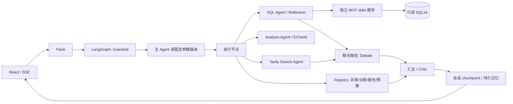

# 航空运营诊断 Agentic BI

基于 **LangGraph + Flask + React** 的可控型多 Agent 运营分析工作台。用户提出问题后，主 Agent 选择 SQL、分析、搜索或联合分析路径，Web 用 SSE 展示执行节点、SQL、来源、质量检查和 ECharts 结果。

项目服务于历史运营复盘：**哪里异常 → 哪些报告原因值得复核 → 谁来调查和试点 → 用什么指标验证**。它不提供实时票务查询，也不自动下发航空调度指令。

## 先跑起来

本机目录：

```bash
cd /Users/eddiel/Documents/flight-weather-agent
```

其他人 clone 后，进入自己克隆的 `flight-weather-agent` 目录即可。后端是 Python，不使用 `go run`。前端构建产物和浏览器依赖已在 `static/`，启动无需 npm，也不需要访问 CDN。

首次安装（已有 `.venv` 和依赖可跳过）：

```bash
python3 -m venv .venv
.venv/bin/python -m pip install -r requirements.txt
```

本次验证环境为 macOS / Python 3.14；`requirements.lock.txt` 记录该环境完整版本。跨平台先用 `requirements.txt`，然后运行回归。不要把本机锁文件当作所有 Python 版本都已测试的保证。

### 无 Key 离线演示

```bash
cd /Users/eddiel/Documents/flight-weather-agent
APP_MODE=demo PORT=5010 ./start_web.sh
```

打开 <http://127.0.0.1:5010>，输入任意本地用户标识进入。

脚本首次会生成 `data/demo_operations.db`，不覆盖历史库。此模式是**固定问题场景路由 + 真实 LangGraph/SQLite/MCP 执行**，不调用 LLM 或 Tavily，不代表自然语言理解效果。页面明确显示虚拟数据与离线模式。

推荐演示顺序：

1. `最近30天哪些机场取消率异常？与前30天对比。`：发现 CCC 取消异常。
2. `诊断AAA最近30天的延误原因并给出建议。`：报告天气原因突出。
3. `诊断BBB航司ZX最近30天的延误原因并给出建议。`：前序晚到传播突出。
4. `最近30天机场延误率画图。`：经独立 MCP 服务执行 SQL，展示数据图表。
5. `生成运营周报。`：严格 7 个自然日，显示有效到达样本和取消率。
6. `结合行业基准对比延误率。`：内部查询照常完成；明确拒绝用虚拟数据和缺失外部证据下行业结论。

### 真实模型 + 历史数据

```bash
cd /Users/eddiel/Documents/flight-weather-agent
export QWEN_API_KEY="你的 Key"
export TAVILY_API_KEY="你的 Tavily Key"  # 搜索可选
# 仅在 data/flight_weather.db 不存在时初始化：
.venv/bin/python data/init_flight_weather_db.py
APP_MODE=live PORT=5001 ./start_web.sh
```

已有历史库时，跳过初始化命令，直接启动。端口被占用就换成 `PORT=5011`。脚本从任何工作目录调用都会进入项目根目录。

从旧版本升级时，运行一次 `.venv/bin/python data/refresh_kpi_view.py` 更新 KPI 视图（不改航班记录）；当前机器已完成。

默认保留你选择的 `qwen3.8-2.4t-a95b`（`config/config.yaml`）。当前配置优先读取 `QWEN_API_KEY`；模型是否有权限以实际调用结果为准。可在启动时覆盖，不必编辑代码：

```bash
LLM_MODEL=qwen-plus APP_MODE=live PORT=5001 ./start_web.sh
```

旧变量名 `DASHSCOPE_API_KEY` 仍兼容。

`LLM_BASE_URL` 可覆盖兼容接口地址；请使用与你的 Key 地域/产品匹配的地址。403 `access_denied` 属于服务端授权拒绝，不能靠前端修复；检查百炼账户、Key 和模型权限。诊断时保留错误 request_id，参见 [阿里云错误码](https://help.aliyun.com/zh/model-studio/error-code)。

也可用真实模型分析虚拟库，验证整条模型路由链：

```bash
APP_MODE=live FLIGHT_DB_PATH=data/demo_operations.db PORT=5001 ./start_web.sh
```

等价后端入口是 `APP_MODE=demo PORT=5010 .venv/bin/python app.py`，但直接运行前需先生成数据。

Windows PowerShell：

```powershell
python -m venv .venv
.\.venv\Scripts\python -m pip install -r requirements.txt
.\.venv\Scripts\python data\generate_demo_data.py
$env:APP_MODE = "demo"
$env:PORT = "5010"
.\.venv\Scripts\python app.py
```

## 数据与业务口径

- 历史库：`data/flight_weather.db`，本次检查 148,273 条记录，2023-01-01 至 2025-07-31。来源为本地 CSV，原始采集与天气关联过程未独立核验，不能称为完整航空行业数据。
- 虚拟库：固定种子 42，14,400 条、90 天、虚构机场 AAA/BBB/CCC/DDD 与航司 ZX/ZY。场景注入用于功能回归，不用于模型真实性能评估或行业对比。
- 最近 N 天：以库内 `MAX(FL_DATE)` 为锚点，含当天，起点减 N−1 天；前期为紧邻的不重叠等长窗口。
- 到达延误率：到达延误 ≥15 分钟 / 非取消、非备降且到达延误已观测航班。取消率另算，缺失值不补成准点。
- 报告原因：按同单位“分钟”排序；天气分组率差单列，不能与分钟混排。NAS 不等于机场拥堵，前序晚到不等于航司过错。
- 收益：仅对选中原因分钟施加假设比例，展示情景量级；不是因果估计、预测、节省承诺或利润。

历史数据能支持复盘和试点优先级；它不能证明某项预案有效。完整字段解释与限制见 [数据契约](docs/data-contract.md)。

## 执行链路



普通 API 和 SSE 共用 `agents/workflow.py`，不再分别维护两套编排逻辑。联合路径用两个真实并发任务执行 SQL 和搜索。SSE 是**节点/证据级实时推送**，最终回答审校后发送，不伪装逐 token 生成。

LLM 自主选择有限意图和允许的参数；执行、重试、数据库权限和证据门槛由代码控制。ops skills 是确定性分析，不声称每个 Python 类都是自主 Agent。

## 工程边界

- **SQL**：NL2SQL 经 MCP，数据库路径显式传入子进程；执行器使用 SQLite `mode=ro`、`query_only`、authorizer、行数上限和 VM 执行时限。固定统计 skills 复用同一只读执行模块，本地执行，不虚称所有 SQL 都走 MCP。
- **Reflection**：最多额外重试 N 次，记录每次 SQL、错误、阶段和耗时。不能把执行成功等同语义正确。
- **Skill Registry**：8 项 YAML 声明；显式绑定 callable，调用前核验权限标签和参数名，函数负责值范围。无任意 import、动态插件加载或代码执行。
- **Debate**：评分不能越过证据硬门槛；未知观测期、缺少来源、指标口径未核验、虚拟数据都会降级。普通搜索摘要不会自动获得“同口径行业均值”资格。
- **Critic**：真实模式做结构化审校，固定统计及硬门槛结论保留原计算值，只展示审校提示；离线模式标记模板输出。模型审校是辅助判断，不是数学正确性证明；不可用会暴露状态。
- **Memory**：LangGraph checkpoint 保存短期会话；SQLite 持久化显式用户偏好。256 维哈希词袋向量召回 + 关键词兜底，不是训练过的语义 embedding。模型分析结论不自动写成长期业务事实。
- **可观测性**：每次请求有 request_id；SSE 推送阶段耗时；`data/traces/<request_id>.json` 保存耗时/失败阶段，默认不记录问题、Key、记忆或查询明细。`done` 始终最后发送。
- **本地部署**：默认只监听 127.0.0.1，关闭 debug；cookie 绑定当前用户，重置只清当前用户。同名本地用户仍共享记忆，**这不是生产身份认证**；对外部署需接入真实登录/授权、持久任务和服务治理。

## 验证

无需任何 Key：

```bash
.venv/bin/python -m pip check
.venv/bin/python eval/run_regression.py
.venv/bin/python eval/nl2sql_golden_eval.py --validate-only
```

报告：`eval/results/offline-regression.json`、`eval/results/golden-validation.json`。`--validate-only` 仅验证黄金 SQL，不计算模型准确率。只有虚拟库时加 `--db data/demo_operations.db`。

真实 NL2SQL：

```bash
export QWEN_API_KEY="你的 Key"
.venv/bin/python eval/nl2sql_golden_eval.py --output eval/results/live-nl2sql.json
```

评测保留重复行、NULL 和列值对应关系；排序题验证行序。空参考结果标记 inconclusive，避免两个空结果被算成正确。本次未跑真实模型准确率，原因是当前执行环境没有模型 Key。

前端改动后构建：

```bash
node scripts/build_frontend.cjs
```

浏览器回归（需要本地 Playwright 与 Chromium）：`TEST_BASE_URL=http://127.0.0.1:5010 node scripts/ui_smoke.cjs`。截图和结果写入 `artifacts/ui/`。

## 目录与面试材料

- `agents/workflow.py`：唯一 LangGraph 编排；`agents/master_agent.py` 为公共入口。
- `agents/sql_agent.py`、`mcp_sql_server.py`、`tools/sql_executor.py`：推理/协议/执行边界。
- `tools/metrics.py`、`tools/ops_decision_skills.py`：统计契约、诊断和行动情景。
- `static/app.js`：React JSX 源码，含 `useSSEChat` 和拆分组件；`app.compiled.js` 为构建产物。
- [评测报告](docs/agent-evaluation-report.md)、[简历逐项核对与演示](docs/interview-defense.md)、[Skill 设计](docs/skill-registry.md)。

后续实时扩展：新建 Flight Status / Weather / Airport Capacity tools，保留观测时间、采集时间、延迟、来源和限流策略，经 Registry 接入独立监控路径。历史诊断不能直接冒充实时预测。当前没有接入实时航班 API。
