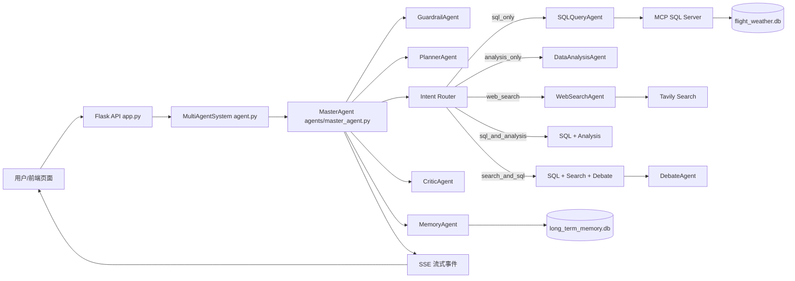
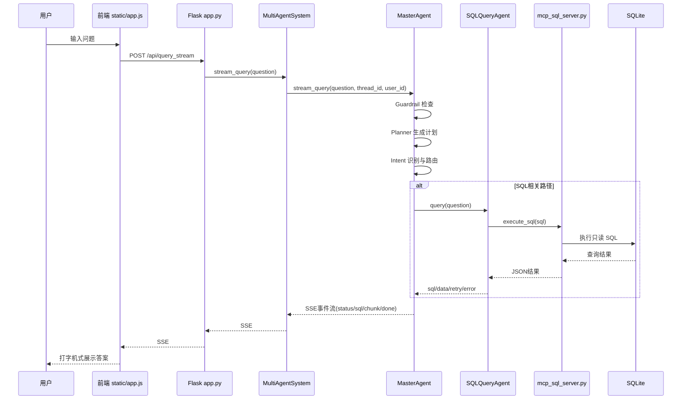
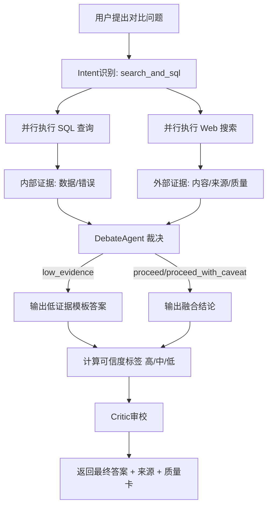
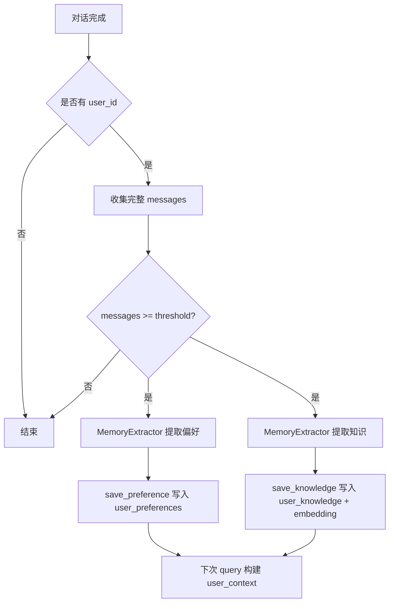

# 多智能体航班-天气分析系统：初学者项目教程

本教程面向第一次接触这个项目的同学。你不需要先懂 LangGraph 或 MCP，也可以按这份文档把项目跑起来、看懂主流程、知道每个模块干什么。

---

## 1. 这个项目是做什么的

这是一个多智能体数据分析系统，场景是航班运行与天气影响分析。

你可以把它理解成一条流水线：

1. 用户提问（自然语言）
2. 主智能体判断要走哪条路径（SQL、分析、联网搜索、或组合）
3. 子智能体执行任务
4. 质量治理智能体做审校/裁决
5. 返回回答给前端（支持流式打字）
6. 会话结束后自动抽取长期记忆（偏好和知识）

项目的核心能力：

- NL2SQL：把自然语言问题变成 SQL
- SQL 自动纠错：SQL 失败后自动修复重试
- 数据分析：对查询结果给洞察并自动生成 ECharts 图
- 联网搜索：对接 Tavily 获取外部信息
- 证据裁决：内部数据 + 外部搜索联合判断，输出可信度
- 长短期记忆：会话上下文 + 跨会话用户偏好与知识

---

## 2. 先看总体架构（建议先看图再看代码）



这张图里最关键的是：

- MasterAgent 是编排中枢
- SQL 执行被拆到 MCP 进程里，不直接在主进程执行
- Search + SQL 路径会走 Debate 裁决
- 最终回答在返回前还会经过 Critic 审校

---

## 3. 项目目录怎么读（初学者推荐顺序）

建议按这个顺序阅读：

1. [README.md](../README.md)
2. [app.py](../app.py)
3. [agent.py](../agent.py)
4. [agents/master_agent.py](../agents/master_agent.py)
5. [agents/sql_agent.py](../agents/sql_agent.py)
6. [agents/search_agent.py](../agents/search_agent.py)
7. [agents/analysis_agent.py](../agents/analysis_agent.py)
8. [agents/debate_agent.py](../agents/debate_agent.py)
9. [memory/long_term_memory.py](../memory/long_term_memory.py)
10. [memory/memory_extractor.py](../memory/memory_extractor.py)
11. [mcp_sql_server.py](../mcp_sql_server.py)
12. [static/app.js](../static/app.js)

如果你时间有限，先读 2, 3, 4, 5, 12，就能理解 80% 主流程。

---

## 4. 环境准备与启动

### 4.1 依赖安装

```bash
pip install -r requirements.txt
```

### 4.2 配置环境变量

Windows PowerShell 示例：

```powershell
$env:DASHSCOPE_API_KEY = "你的模型Key"
$env:TAVILY_API_KEY = "你的搜索Key"  # 可选，不配也能跑 SQL 路径
```

### 4.3 初始化数据库（首次）

```bash
python data/init_flight_weather_db.py
python data/init_memory_db.py
```

### 4.4 启动 Web

```bash
start_web.bat
```

浏览器访问：http://localhost:5000

---

## 5. 配置文件说明

配置在 [config/config.yaml](../config/config.yaml)。

关键项：

- llm.model：默认 qwen-plus-latest
- database.path：默认 ./data/flight_weather.db
- memory.long_term_db：默认 ./data/long_term_memory.db
- search.tavily_api_key：联网搜索 Key

建议初学者先保持默认，不要一开始改太多。

---

## 6. 一次查询是怎么跑完的

下面是前端流式查询从输入到结果返回的时序。



你在前端看到的 “正在识别意图 / 正在查询数据库 / 正在生成回答” 都是 SSE 的 status 事件。

---

## 7. MasterAgent 详解（项目核心）

代码在 [agents/master_agent.py](../agents/master_agent.py)。

### 7.1 MasterAgent 做了什么

- 构建 LangGraph 工作流（intent -> 各执行节点 -> summarize）
- 管理意图识别与路由
- 统一调用 SQL / 分析 / 搜索 / 联合路径
- 注入质量治理（Guardrail、Debate、Critic）
- 管理短期记忆（checkpointer）和长期记忆提取
- 提供阻塞式 query 和流式 stream_query 两个入口

### 7.2 为什么它是“workflow”，不是“全自主 Agent”

项目使用固定节点图和条件分支：

- 意图先判定
- 再进入预定义节点
- 节点完成后汇总

这类设计工程上更稳定、可控、可观测，适合业务系统。

---

## 8. 子智能体拆解

### 8.1 SQLQueryAgent

代码在 [agents/sql_agent.py](../agents/sql_agent.py)。

主要能力：

- 根据 schema + few-shot 生成 SQL
- 自动清洗 LLM 输出（去代码块、去 think）
- 时间锚点修正：把 now/current_date 替换成表内 MAX(FL_DATE)
- SQL 只读校验（阻断多语句和 DDL/DML）
- 执行失败后自动纠错重试（最多 3 次）
- 通过 MCP 工具执行 SQL，返回结构化结果

关键返回字段：

- sql：最终执行 SQL
- data：成功结果 JSON
- error：错误信息
- retry_count：修复次数
- failure_stage：失败阶段
- latency_ms：时延

### 8.2 DataAnalysisAgent

代码在 [agents/analysis_agent.py](../agents/analysis_agent.py)。

主要能力：

- 解析 SQL 返回数据
- 生成文字分析（概览、发现、建议）
- 自动判断是否值得画图
- 让 LLM 生成 ECharts 配置并返回给前端

如果图表生成失败，不会中断主回答，只是 chart 为 null。

### 8.3 WebSearchAgent

代码在 [agents/search_agent.py](../agents/search_agent.py)。

主要能力：

- 调用 Tavily 搜索外部信息
- 做领域相关性评分和过滤（航班/天气语义）
- 两阶段检索（主查询 + fallback 查询）
- 证据质量分级：strong / proxy / none
- 证据不足时降级回答，不乱给确定性结论

这就是为什么它比“直接搜一下然后总结”更稳。

### 8.4 DebateAgent

代码在 [agents/debate_agent.py](../agents/debate_agent.py)。

作用：在 search_and_sql 路径中，对内部 SQL 证据和外部搜索证据进行可解释裁决。

评分维度：

- 内部数据可用性
- 外部证据充分性
- 行业口径匹配
- 时间可比性

然后给出决策：

- proceed
- proceed_with_caveat
- low_evidence

低证据时输出结构化“为什么不能给确定性结论 + 下一步建议”。

### 8.5 CriticAgent

代码在 [agents/critic_agent.py](../agents/critic_agent.py)。

作用：最终回答出站前做质量审校。

Rubric：

- groundedness（事实依据）
- completeness（完整度）
- clarity（清晰度）
- actionability（可执行性）

总分高于阈值偏向 pass，否则 revise。

### 8.6 GuardrailAgent

代码在 [agents/guardrail_agent.py](../agents/guardrail_agent.py)。

作用：拦截高风险输入（如 drop table、delete from、ignore previous）。

位置：在查询流程最前面，属于前置安全闸门。

---

## 9. Search + SQL 联合链路（最关键业务流程）



这条链路体现了项目最重要的工程思想：

- 不是搜到一点内容就“硬对比”
- 先判断证据质量，再决定回答力度

---

## 10. 记忆系统：短期 + 长期

### 10.1 短期记忆

- 在 MasterAgent 的 LangGraph checkpointer 中
- 作用范围：当前会话 thread_id
- 超长会话会做历史压缩总结

### 10.2 长期记忆

代码在 [memory/long_term_memory.py](../memory/long_term_memory.py)。

长期库包含三类信息：

- users：用户基础信息
- user_preferences：用户偏好键值对
- user_knowledge：用户知识条目（含 confidence 与 embedding）

### 10.3 召回策略

- 主路径：向量相似度（哈希词袋 embedding + cosine）
- 辅助项：关键词 overlap + confidence
- 兜底：LIKE 查询（防止冷启动召回空）

### 10.4 记忆提取触发

代码在 [memory/memory_extractor.py](../memory/memory_extractor.py)。

触发逻辑：

- 默认消息数 >= 6 才提取
- 提取偏好和知识并写入长期库

这解释了为什么“只聊一两句”时，偏好未必立刻入库。

---

## 11. MCP SQL 服务器为什么单独存在

代码在 [mcp_sql_server.py](../mcp_sql_server.py)。

它不是“多余一层”，而是做职责分离：

- LLM 负责生成 SQL
- MCP 服务负责执行 SQL

好处：

- 执行边界更清晰
- 便于统一审计与扩展
- 出错返回结构化信息，方便 SQL Agent 做 Reflection 修复

---

## 12. 前端如何消费流式事件

前端主逻辑在 [static/app.js](../static/app.js)。

流式事件类型包括：

- status：状态提示
- plan：Planner 计划
- trace：执行轨迹
- intent：意图
- sql：生成 SQL
- quality：质量卡
- sources：参考来源
- chart：图表配置
- chunk：回答分片
- done：结束

前端会把质量信息渲染成“决策质量卡”，并显示可信度高/中/低。

---

## 13. 数据层说明

### 13.1 业务数据库

初始化脚本在 [data/init_flight_weather_db.py](../data/init_flight_weather_db.py)。

核心对象：

- 表 flights_enriched：航班 + 天气主表
- 视图 v_flight_monthly_kpi：按月按航司 KPI

### 13.2 记忆数据库

初始化脚本在 [data/init_memory_db.py](../data/init_memory_db.py)。

核心对象：

- users
- user_preferences
- user_knowledge（含 embedding 字段）

---

## 14. 初学者调试清单（遇到问题先查这里）

### 14.1 页面起不来

检查：

1. 是否执行了 start_web.bat
2. 5000 端口是否被占用
3. DASHSCOPE_API_KEY 是否配置

### 14.2 只能 SQL，不能联网

检查：

1. TAVILY_API_KEY 是否配置
2. 是否安装 langchain-tavily

### 14.3 SQL 总失败

检查：

1. 数据库路径是否正确（config.yaml）
2. 表是否存在（flights_enriched）
3. 查看前端 SQL 面板中的重试次数和错误

### 14.4 记忆看起来没生效

检查：

1. 对话轮次是否达到提取阈值
2. user_id 是否一致
3. long_term_memory.db 是否被重置

---

## 15. 给初学者的阅读与实践路线

### 第 1 天（跑通）

1. 跑起项目
2. 在网页提 3 个问题：SQL、分析、搜索
3. 观察 status/trace/sql/quality 事件变化

### 第 2 天（看懂主流程）

1. 读 app.py + agent.py + master_agent.py
2. 画出你自己的流程图
3. 用一句话解释每个 agent 的职责

### 第 3 天（动手改）

1. 在 prompts.py 增加一个 few-shot SQL 示例
2. 在 search_agent.py 调整 evidence 判定阈值
3. 在前端增加一个“只看内部数据”按钮

---

## 16. 面试可用的项目总结（可背诵）

这个项目是一个基于 LangGraph 的多智能体航班分析系统。核心做法是用 MasterAgent 做流程编排，把 SQL、搜索、分析、审校、安全和记忆拆成职责清晰的子智能体；通过 MCP 解耦 SQL 执行，通过 Debate + Critic 建立质量治理链路，通过 SSE 暴露全流程可观测事件。相比单体问答，它在可靠性、可解释性和可维护性上更接近可上线的工程系统。

---

## 17. 附：关键流程图（记忆提取）



你可以把这张图当成“为什么记忆不是每轮都更新”的答案图。

---

如果你刚入门，建议你先把第 6 节和第 9 节彻底看懂，这两节就覆盖了项目最重要的业务路径和工程价值。